<div align="center">

# 👋 Hey, I'm **Om Sinha**

### 🔐 CyberSecurity & Digital Forensics | 💻 Full-Stack Developer | 🤖 AI/ML Explorer

<a href="https://github.com/Hacker-Godgif">

</a>

<a href="https://github.com/Hacker-Godgif?tab=followers">

</a>

<br><br>


<br><br>

<a href="https://github.com/Hacker-Godgif">

</a>

<a href="https://linkedin.com/in/omsinha">

</a>

</div>

---

## 🧑‍💻 About Me

I'm **Om Sinha**, a **Third-Year B.Tech Computer Science Engineering student specializing in CyberSecurity and Digital Forensics**.

I enjoy building practical software and exploring the intersection of **security, digital forensics, full-stack development, AI/ML, blockchain and system architecture**.

<details>
<summary>💻 Developer Profile</summary>

```javascript
const omSinha = {
    name: "Om Sinha",
    education: "B.Tech CSE",
    year: "Third Year",

    specialization: [
        "CyberSecurity",
        "Digital Forensics"
    ],

    interests: [
        "CyberSecurity",
        "Digital Forensics",
        "Full-Stack Development",
        "Machine Learning",
        "Blockchain",
        "System Architecture"
    ],

    philosophy: "Build → Break → Learn → Improve → Repeat 🚀"
};
```

</details>

---

## 🔐 Areas of Interest

| 🛡️ CyberSecurity & Forensics | 💻 Development | 🤖 AI / ML | ⛓️ Emerging Tech |
|---|---|---|---|
| Digital Forensics | Full-Stack Apps | Machine Learning | Blockchain |
| Cybercrime Investigation | REST APIs | AI Applications | Smart Contracts |
| Evidence Integrity | Backend Architecture | Data Processing | IPFS |
| Incident Response | Databases | Predictive Systems | Web3 |

---

# 🚀 Featured Projects

## ⛓️ Blockchain-Based Digital Evidence & Chain of Custody

<a href="https://github.com/Hacker-Godgif/Blockchain-Based-Chain-of-Custody">

</a>

A **blockchain-powered digital evidence management system** built around CyberSecurity and Digital Forensics. Digital evidence is cryptographically hashed and custody transfers are recorded on-chain to create a tamper-resistant audit trail.

**Key features:** SHA-256 integrity verification, blockchain logging, chain-of-custody tracking, IPFS storage, Ethereum smart contracts and role-based access control.

**Tech:** `React` `Node.js` `Express` `MongoDB` `Ethereum` `Solidity` `IPFS` `Ethers.js`

---

## 🎓 StudyOS India

<a href="https://github.com/Hacker-Godgif/CopyCats-OmSinha">

</a>

A student-first academic workspace for managing **attendance, deadlines, study planning and campus-policy information**. It also supports timetable and attendance image processing through a configurable AI vision endpoint.

**Key features:** attendance tracking, weekly planning, deadline management, calendar export, policy assistance, timetable extraction and attendance image processing.

**Tech:** `Python` `Flask` `SQLite` `AI/Vision Models`

---

## 🏡 Delish Rich Hospitality

<a href="https://github.com/Hacker-Godgif/Delish-Rich">

</a>

A modern **full-stack hospitality and product showcase platform** with a customer-facing catalogue and an administrative management system.

**Key features:** product catalogue, project showcase, customer inquiries, JWT authentication, product/project management, bulk image upload and CSV product import.

**Tech:** `React` `Vite` `Node.js` `Express.js` `MongoDB` `JWT` `Cloudinary`

---

## 🤖 F.R.I.D.A.Y — Voice Assistant

<a href="https://github.com/Hacker-Godgif/F.R.I.D.A.Y---Voice-assistant">

</a>

A Python-based voice assistant project built to explore **voice interaction, automation and external API integrations**, including weather and WolframAlpha services.

**Tech:** `Python` `APIs` `Voice Processing` `Automation`

---

# 🧰 Tech Stack

<div align="center">


<br><br>

`Ethereum` `Solidity` `IPFS` `Ethers.js` `Web3.js` `REST APIs`

</div>

---

# 📊 GitHub Analytics

<div align="center">

<a href="https://github.com/Hacker-Godgif">

</a>

<a href="https://github.com/Hacker-Godgif">

</a>

</div>

> These cards are generated by GitHub Actions and stored directly in this repository, so the profile does not depend on the public `github-readme-stats` server.

---

# 🔥 Contribution Streak

<div align="center">

<a href="https://github.com/Hacker-Godgif">

</a>

</div>

> The streak card is generated by GitHub Actions and stored directly in this repository.

---

# 🐍 Contribution Snake

<div align="center">


</div>

> The snake is generated automatically by **GitHub Actions** and published to the `output` branch every 24 hours.

---

# 🧠 Currently Learning

<details>
<summary>🔐 CyberSecurity & Digital Forensics</summary>

- Digital Evidence Analysis
- Incident Response
- Network Forensics
- Cybercrime Investigation
- Evidence Acquisition
- Chain of Custody
- Secure Application Development

</details>

<details>
<summary>💻 Software Engineering</summary>

- Data Structures & Algorithms
- System Design
- Backend Architecture
- Database Optimization
- Distributed Systems
- Cloud Deployment

</details>

<details>
<summary>🤖 AI / ML</summary>

- Machine Learning
- Deep Learning
- Computer Vision
- AI-powered Applications
- Intelligent Automation

</details>

---

# 🎯 Goals

- [ ] 🔐 Deepen CyberSecurity & Digital Forensics expertise
- [ ] 🧠 Strengthen DSA and problem solving
- [ ] 🚀 Build production-grade applications
- [ ] 🤖 Build practical AI systems
- [ ] ⛓️ Explore Blockchain security
- [ ] 🌐 Contribute to Open Source
- [ ] 💻 Build software that solves real problems

---

# 💭 Developer Philosophy

<div align="center">

### **Think → Build → Break → Debug → Learn → Improve**

> **"Don't just learn how it works. Build it."**

</div>

---

<div align="center">

### ⚡ Thanks for visiting my profile!


</div>
